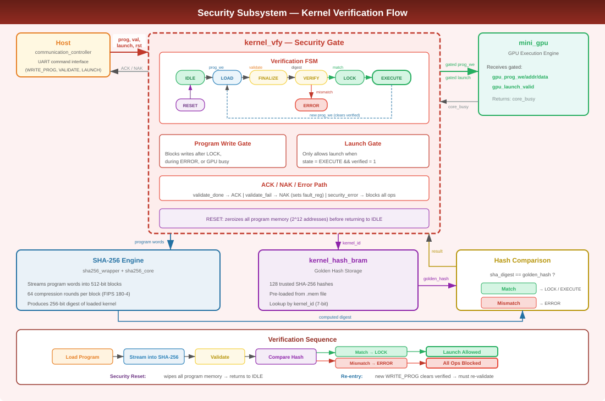
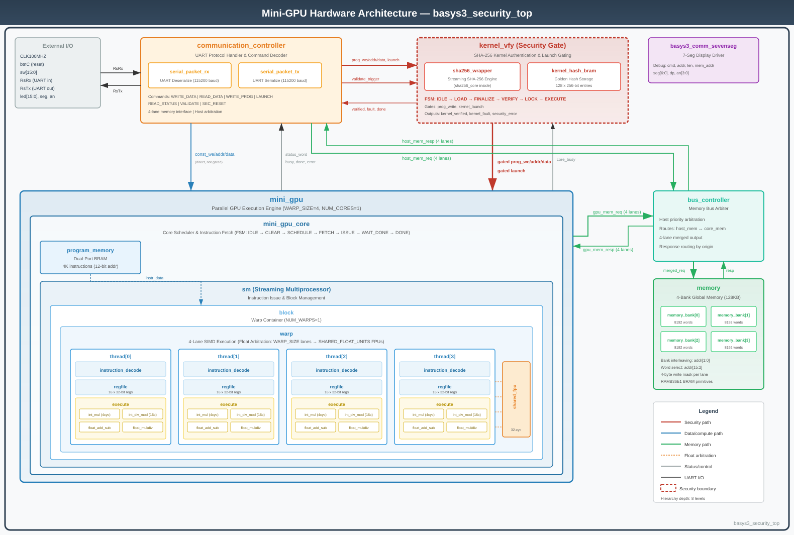

# Mini-GPU: FPGA Accelerator with Hardware-Enforced Secure Kernel Launch

Mini-GPU is an FPGA-based accelerator with a custom hardware/software stack, including Verilog/SystemVerilog RTL, UART host communication, a C++/Python runtime, and PyTorch integration.

This is an active project. A full technical report with detailed architecture, verification results, and final FPGA utilization data is forthcoming.

## Contributions
### Daniel

- Designed and implemented the Mini-GPU compute architecture and execution pipeline
- Built the CUDA-to-binary compiler toolchain
- Implemented the C++ runtime layer for kernel loading, buffer management, and device execution
- Integrated Mini-GPU with PyTorch as a custom `PrivateUse1` backend
- Implemented FPGA-dispatched tensor operations including matmul, add, ReLU, and convolution
- Developed end-to-end demos and correctness tests for PyTorch operation dispatch
- Integrated host-side software flow with UART communication and kernel launch APIs

### Luke

- Designed the secure kernel-launch architecture for the FPGA accelerator
- Implemented the hardware communication/control path with RX/TX packet parsers, command decoding, and UART transport
- Used SHA-256 IP for kernel verification against trusted golden hashes
- Added launch gating and instruction-memory locking to block unauthenticated kernels
- Integrated security policy with UART command parsing, CRC validation, and ACK/NACK fault signaling
- Verified secure-launch behavior with Icarus Verilog testbenches and VCD waveform debugging
- Used Yosys and Vivado to analyze resource usage and FPGA implementation tradeoffs

## Security Architecture

Trusted hardware:
- `kernel_vfy` security FSM
- SHA-256 kernel hash engine
- Golden hash memory
- Launch-gating logic
- Instruction-memory protection logic

Untrusted inputs:
- Host software
- UART communication
- Uploaded kernel bytes
- Launch and validate commands

<!-- ## Verification

Security/fault cases tested:

| Case | Expected Behavior |
|---|---|
| Valid kernel upload + matching hash | Kernel verified; launch allowed |
| Hash mismatch | Launch blocked; error/NACK path |
| Launch before validation | Launch blocked |
| CRC failure during program upload | Fault/error handling |
| Invalid validate command sequence | No deadlock; validation rejected |
| Security reset | Verified state cleared; instruction memory zeroized | -->

<!-- ## Resource / Implementation Results

Preliminary FPGA resource data will be updated as final Vivado results are collected.

| Metric | Baseline Mini-GPU | Secure Mini-GPU | Notes |
|---|---:|---:|---|
| LUTs | TBD | TBD | Vivado synthesis/implementation |
| FFs | TBD | TBD | Vivado synthesis/implementation |
| BRAM | TBD | TBD | Vivado synthesis/implementation |
| WNS | TBD | TBD | Timing currently under analysis | -->

### Secure Kernel Launch

The host uploads a kernel over UART using the program-write command path. As accepted program words are written into instruction memory, the security gate streams the same words into a SHA-256 engine.

After upload, the host sends a validate command with a kernel ID. The hardware compares the computed digest against a trusted golden hash stored on the FPGA. If the hash matches, the security FSM locks instruction memory and allows launch. If validation fails, launch is blocked and the design enters an error/NACK path.

Security goal:

> Only authenticated kernels may execute, and verified instruction memory cannot be modified while execution is allowed.

### Design Tradeoffs

Several security approaches were considered before selecting kernel verification:

| Approach | Goal | Outcome |
|---|---|---|
| Encrypted transport | Protect confidentiality of UART traffic | Not used due to FPGA resource cost |
| Weight verification | Authenticate model weights before execution | Not used because training workloads mutate weights and tensors |
| Kernel verification | Authenticate executable code before launch | Selected final design |

Kernel verification was selected because executable kernels are the stable trust boundary across both inference and training workloads.

## Repository Map

- `compiler/`
CUDA-to-binary compiler toolchain. Takes CUDA kernel source through a multi-stage pipeline (AST &rarr; IR &rarr; ISA &rarr; binary) and produces `.mem` program files along with their SHA-256 hashes for secure loading.

- `gpu_comm/`
Host-to-FPGA communication library. Implements the UART serial protocol in C with pybind11 Python bindings, handling packet framing, opcodes, and data transfer between the host PC and the Basys3 board.

- `hardware/` All FPGA Verilog HDL source, testbenches, and synthesis scripts.
    - `rtl/`&mdash; Synthesizable RTL organized by function:
        - `top/` &mdash; Top-level modules (`basys3_security_top`, etc.)
        - `core/` &mdash; GPU compute hierarchy (`mini_gpu` &rarr; `sm` &rarr; `block` &rarr; `warp`)
        - `lane/` &mdash; Per-thread datapath (execute, regfile, integer/float ALUs, shared FPU)
        - `memory/` &mdash; 4-bank interleaved data memory and program memory
        - `common/` &mdash; Bus controller, UART communication controller, instruction decode
        - `security/gate/` &mdash; `kernel_vfy` FSM, SHA-256 engine, golden hash BRAM
    - `tb/` &mdash; Testbenches and simulation scripts
    - `tools/` &mdash; Vivado synthesis/implementation TCL scripts
    - `constraints/` &mdash; Basys3 pin constraint files (`.xdc`)

- `runtime/`
C++ host runtime library. Manages device communication, kernel loading, buffer allocation, and the secure kernel registry. Provides the `minigpu_runtime` and `minigpu_kernels` APIs used by higher-level layers.

- `torch_mini_gpu/`
PyTorch custom backend. Registers Mini-GPU as a `PrivateUse1` device and dispatches tensor operations (matmul, add, relu, conv2d, etc.) to the FPGA through the runtime layer.

- `torch_ext/`
C++ extension headers bridging PyTorch's C++ API to the Mini-GPU runtime.

- `demos/`
End-to-end demo applications, including MNIST convolutional training running entirely on the Mini-GPU via the PyTorch backend.

- `test/`
Host-side test suite covering PyTorch op correctness and UART communication.

- `docs/`
Architecture diagrams and planning documents for the project report.

## Full Hardware Architecture

## Third-Party IP

This project uses a modified version of the open-source `secworks/sha256` Verilog SHA-256 core, originally authored by Joachim Strömbergson / Secworks Sweden AB and licensed under the BSD-2-Clause license.

The original license notice is preserved in the modified RTL source files. See `hardware/rtl/security/gate/sha256/LICENSE.txt` for details.